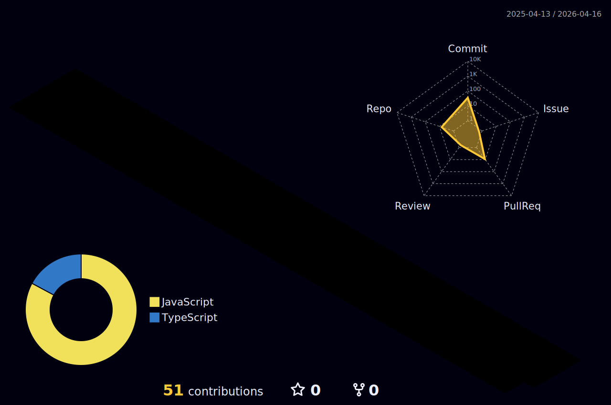

  

  

  
  
  

##  About Me
- Freelance engineer delivering full-stack products for real clients.
- Strong in React frontend and Node.js backend with production mindset.
- Build fast, responsive, and maintainable systems with clear architecture.
- Comfortable across: C, C++, C#, Java, JavaScript, Python.

##  Tech Arsenal

  

##  Featured Projects
### Portfolio ProMax
- High-end personal portfolio with conversion-oriented UX and performance optimization.
- Repo: https://github.com/Ryuga00000001/portfolio-promax

### Van Ban Thanh Giong Noi
- Text-to-speech product focused on usability and accessibility scenarios.
- Repo: https://github.com/Ryuga00000001/van-ban-thanh-giong-noi

### Nexa Store Full Stack
- Full-stack e-commerce solution with frontend, backend APIs, and data integration.
- Repo: https://github.com/Ryuga00000001/nexa-store-full-stack

##  3D Contribution (Auto Generated)

  

##  Stats

  
  

  

  

##  Freelance Services
- Business websites and landing pages
- Admin dashboards and internal tools
- E-commerce and checkout flows
- API integration and workflow automation
- Performance optimization and codebase cleanup

##  Contact
- GitHub: https://github.com/Ryuga00000001
- Email: your-email-here
- LinkedIn: your-linkedin-here
